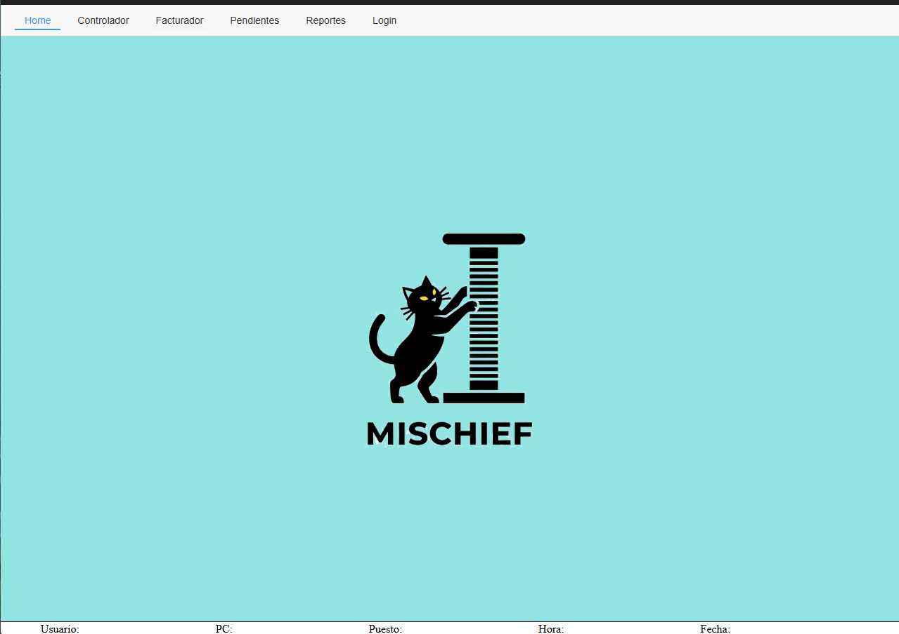
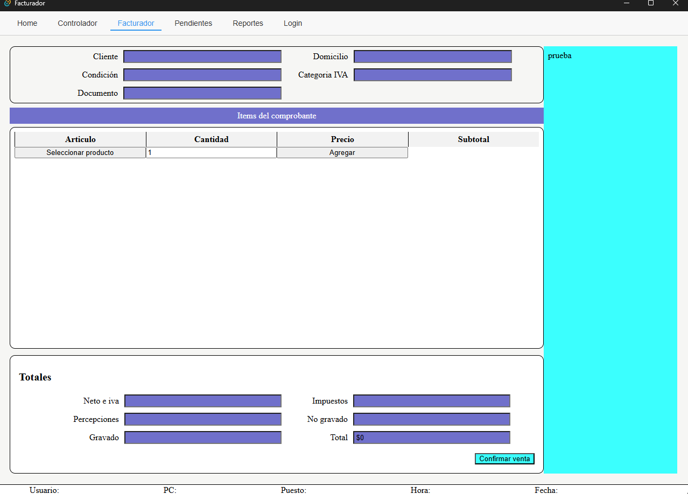
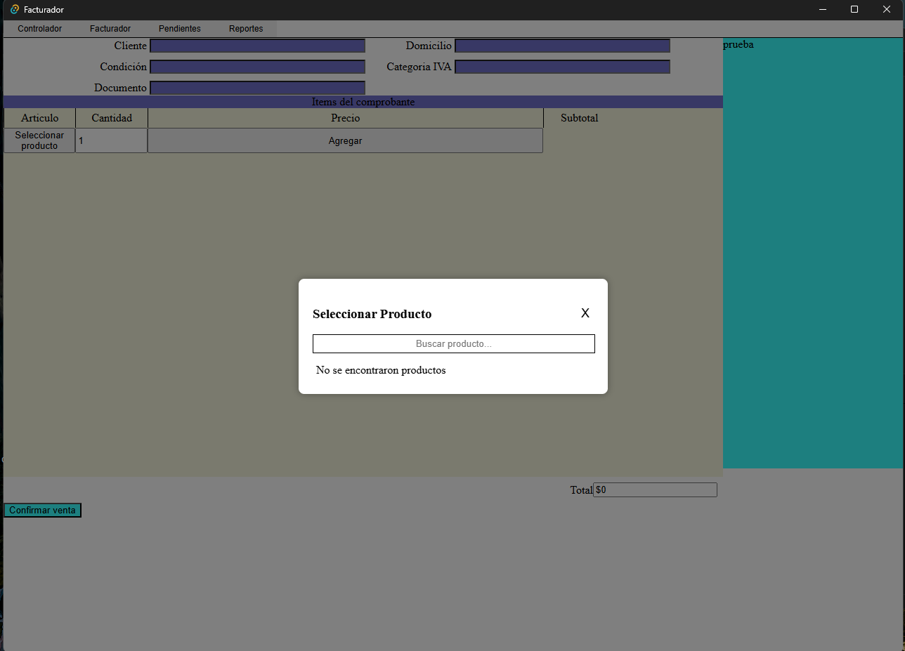
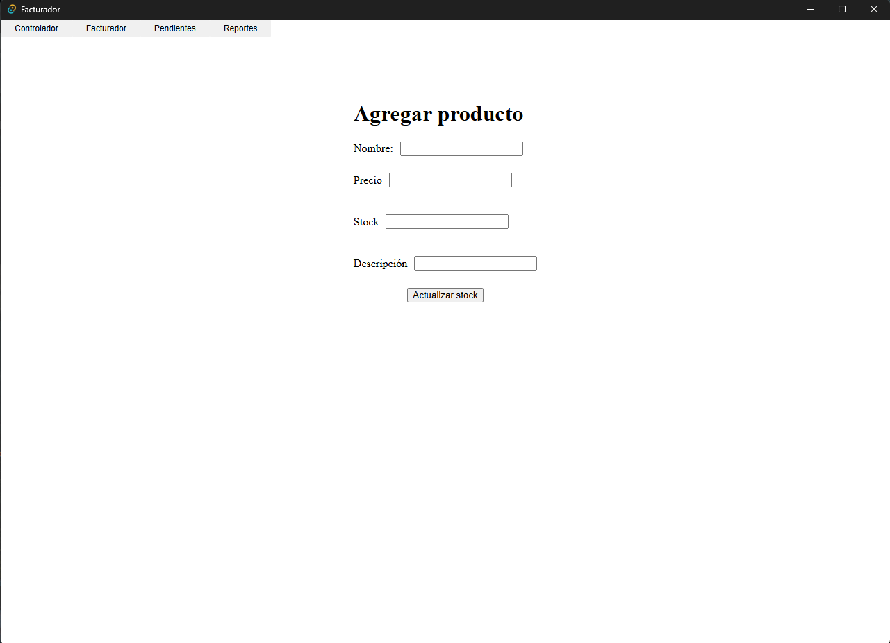
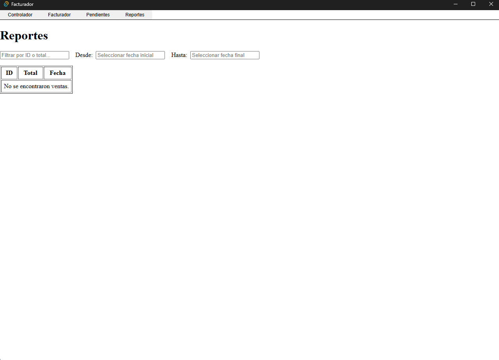

# FacturadorApp

Una aplicación de escritorio desarrollada con **Tauri + React + TypeScript** para gestionar facturación local en negocios.  
Incluye base de datos SQLite, interfaz moderna y opción de sincronización con un backend externo.

---

## 🚀 Características

- Gestión de productos (agregar, editar y eliminar)
- Registro de ventas
- Visualización de tickets
- Base de datos local con SQLite
- Generación de reportes diarios en PDF
- Interfaz limpia y moderna orientada a escritorio
- Posibilidad de sincronizar información con un backend externo

---

## 🛠️ Tecnologías utilizadas

- **Frontend:** React, Vite, TypeScript  
- **Backend (escritorio):** Tauri (Rust)  
- **Base de datos:** SQLite  
- **Sistema operativo objetivo:** Windows  

---

## 📌 Estado del proyecto

- ✅ Funcionalidad básica de añadir productos, gestionar stock y generar ventas  
- 🚧 En desarrollo: reportes diarios en PDF, sincronización con backend, mejoras de interfaz y nuevas funciones (edición de stock, etc.)

---

## 🖼️ Vista previa del proyecto

A continuación se muestran algunas capturas del funcionamiento de la interfaz visual de la aplicación:

### Registro de ventas


### Registro de ventas


### Registro de ventas


### Buscador de productos


### Registro de productos


### Reportes de ventas


---

## ⚙️ Instalación y ejecución local

```bash
# Clonar el repositorio
git clone https://github.com/angelTMontenegro/facturadorapp.git
cd facturadorapp

# Instalar dependencias
npm install

# Ejecutar en modo desarrollo
npm run tauri dev
